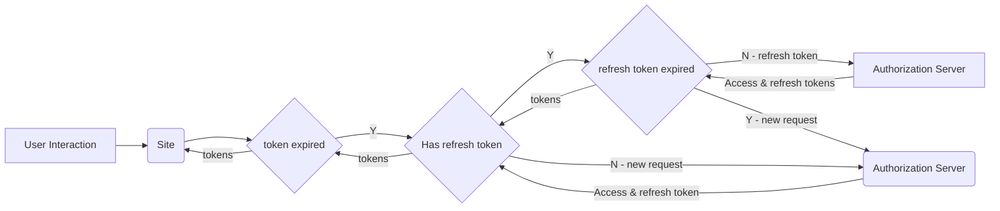
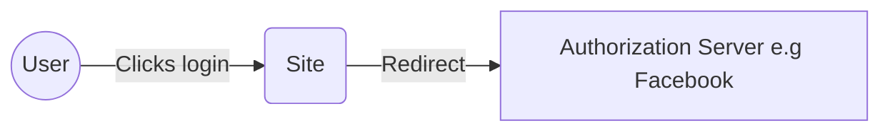
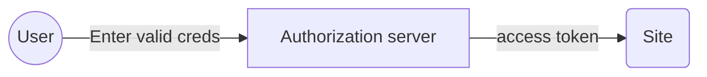
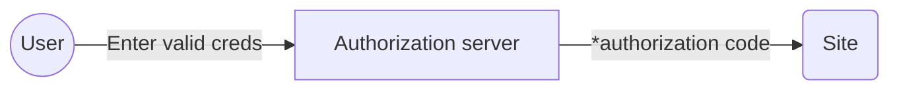
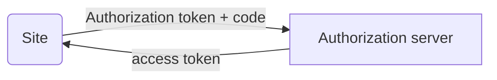
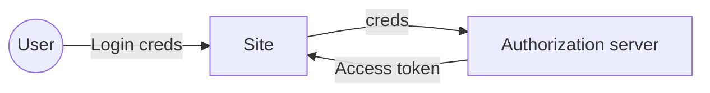
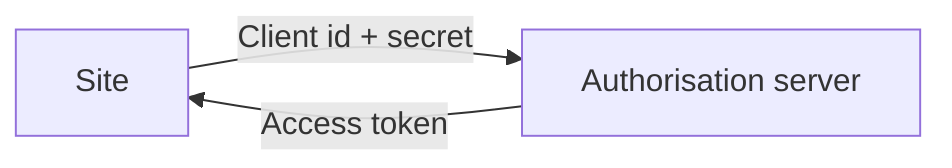

# OAuth

Used to share details from one system in another 

If you are building a service where you need to use a user’s private data that is stored on another system — use OAuth. If not — you might want to rethink your approach!

## 1) Actors
**OAuth provider\Auth server:**
Consists of 
 - Login page + id provider
 - token management infrastructure (e.g. DB)
 - User consent page to share info with app

**Resource Provider**
Resource might be data or service offered in form of web api. 
Role:
 - Checking user is authenticated (requires OAuth token)
 - Checking user is authorised to access data
 
 **Resource Owner**
 The owner of the data. Might be an end user etc. The resource owner gives consent to the app to have access to the resource

**Client**
Is an application that attempts to access a protected resource. Could be web app, cloud app or mobile app.

## 2) OAuth Endpoints

### Authorization end point
This is where the user enters their creds and gives consent for details to be used in calling app. After giving consent the end point returns an authorisation code.

### Token end point
This produces access token and refresh token and returns them to the client as JSON. These request have to originate from a previously registered app (client id, secret).

### Redirect end point
Service offered by client. The authorization end point passes an authorisation code to the client in the url e.g. `http://blah.com?code=Wx5gkdr2`.
 The client can then use this to get an access token.

## 3) OAuth Tokens
Tokens are unique, long random character strings.

### Access tokens
Access tokens are known as bearer tokens. The token contains access rights. You can verify  When you have a token the identity is not checked again.

### Refresh tokens
Have an expiry date longer than access tokens and are used to seamlessly gain a new access token and refresh token. The refresh token is sent to the token endpoint by the client (not the resource provider).

## 4) Token attributes
### Scopes
If you need a fine grained set of rules for access then you can set scopes. 
`A scope is an access right`
The client can request scopes when requesting a new OAuth token.

## 5) Flows/Grants

### Redirect flow
There are two types of flow here. 

`Implicit - simple trade user creds for token. Used when client cannot safely store clientid and client security. Examples are javascript.This results in shorter expiry times.`

`Authorisation code - default flow. It trades user creds for authorisation code then server sends it and the client id & a secret to auth server in http header to get token. Client checks auth server ssl cert and url. Useful for extra security to prevent mitm attacks. Also known as 3-legged OAuth. !Used when client can securely store clientid and client secret. Called 3 legged cos checks 3 actors - OAuth server, resource owner and client`

Common Stage 1:

**Implicit Grant Flow**:
Stage 2:

**Authorisation Code Flow:**
Stage 2:

Stage 2.1

**A) Auth code:**
Example client request to auth server for auth code:
`GET /authorize?response_type=code&scope=name%20phone%20birthdate &client_id=s6BhdRkqt3
&state=af0ifjsldkj
&redirect_uri=https%3A%2F%2FClient.example.org%2Fcb HTTP/1.1`

Example success response from auth server to client (note uses state to ensure request matches to correct response:
`
HTTP/1.1 302 Found
Location: https://client.example.org/cb?code=SplxlOBeZQQYbYS6WxSblA&state=af0ifjsldkj`

**B) Auth token**
Request:
`POST /TOKEN HTTP/1.1
  Host: server.example.com
  Content-Type: application/x-www-form-urlencoded
  Authorization: Basic czZCRSa3F0MzpnWDFm
` 

`grant_type=authorization_code&code=SplxlOBeZQQYbYS6WxSblA&state=af0ifjsldkj`

Response:
`HTTP/1.1 200 OK
   Content-Type: application/json
   {
     "access_token": "SIAV32hkKG",
     "token_type": "Bearer",
     "refresh_token": "8xLOxBtZp8",
     "expires_in": 3600
   }
`

**Resource provider**
The resource provider gets an access token from client and then verifies it via the token verification service. If access token is found to be invalid a http status 401 is returned, if it has expired then 403. Then it would need to use the refresh token against the authorisation end point. 

Client contacts API passing token which contacts Auth server:
Request:
`GET /api
Authorization: Bearer SIAV32hkKG
Host: server.example.com`

Verify happens then JSON from API returns.

## 4) Credential flows
Way to trade creds for access token.

`Client credentials flow - used when you want to connect to a resource on an api without a user connected to the session. Applied when the client is also the resource owner
`

`Resource user password flow: Used when the resource owner can trust the client with their password`

### Resource user password flow:

### Client credentials flow

<!--stackedit_data:
eyJoaXN0b3J5IjpbLTE0MTYzMDc2OTddfQ==
-->